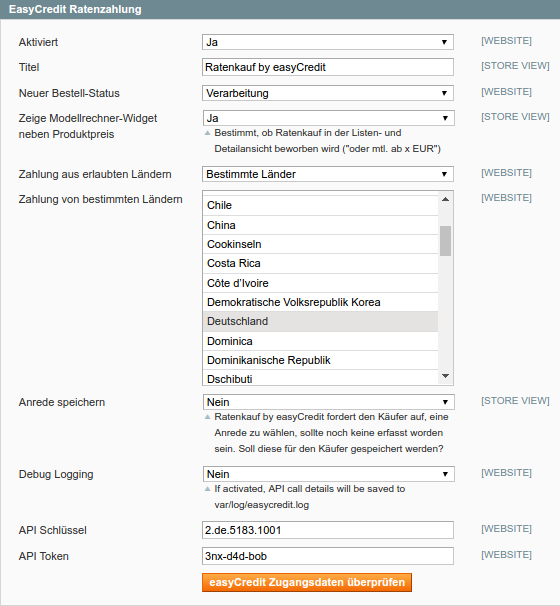
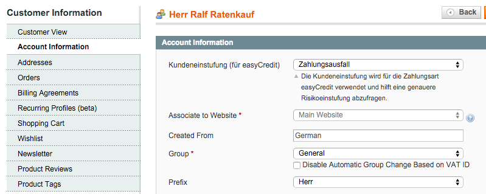
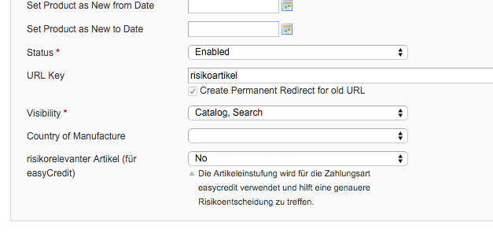

# easyCredit Magento Extension

Das easyCredit Zahlungsmodul für Magento ermöglicht es Ihnen durch einfache Installation Ratenkauf by easyCredit in Ihrem Magento-Store anbieten zu können.
Weitere Informationen zu easyCredit finden Sie unter  [Ratenkauf by easyCredit](https://www.easycredit.de/Ratenkauf.htm)

## Installation

Die Verzeichnisstruktur entspricht der Magento-Verzeichnisstruktur. Die Installation kann durch Kopieren der Dateien in die entsprechende Struktur von Magento erfolgen. Alternativ kann die Installation über [modman](https://github.com/colinmollenhour/modman) erfolgen - ein entsprechendes modman-File liegt bei.

## Konfiguration

### Zahlarten-Einstellung

Die Zahlungsarten-Konfiguration befindet sich in unter *System -> Konfiguration -> Zahlungsarten -> easyCredit Ratenzahlung*

#### API-Zugangsdaten

Hier kann die Zahlungsart aktiviert und deaktviert werden. Nach der Installation müssen hier die **API-Zugangsdaten**, die von der Teambank zur Verfügung gestellt werden, eingetragen werden.

#### Händlername

Zur korrekten Anzeige der rechtlichen Informationen nach Auswahl der Zahlungsmethode (Vereinbarung zur Datenübermittlung), ist es notwendig, dass der Händlername korrekt konfiguriert ist. Notwendig ist der Firmenname mit entsprechender Rechtsform.

### Kundeneinstufung

Pro Kunde kann unter *Kunden -> Kunden verwalten -> Kunde -> Tab: Benutzerkonto Information* eine Kundeneinstufung vorgenommen werden.

### risikorelevante Artikel

Ein Artikel kann unter *Artikel -> Artikel verwalten -> Artikel -> Tab: Allgemein* als risikorelevant definiert werden.

## Kompatibilität

Die Extension wurde unter Magento 1.8 und Magento 1.9.2.2 getestet. Weitere Systemvoraussetzungen sind mit den von Magento in der jeweiligen Vesion genannten abgedeckt.
