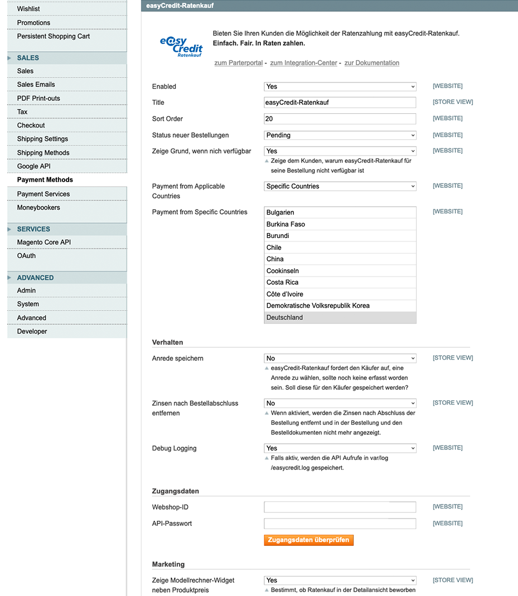
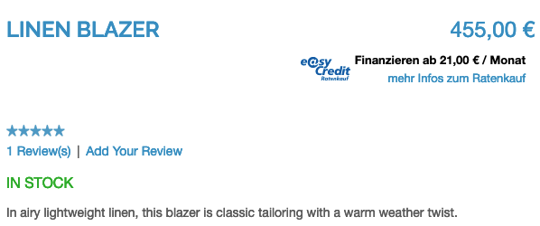
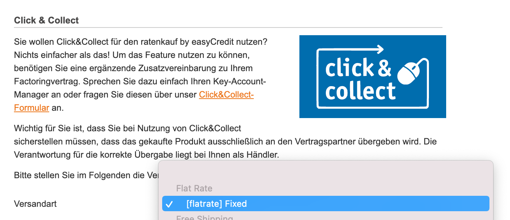

.. _configuration:

============= 
Konfiguration 
=============

Die Konfiguration des Modules befindet sich unter :menuselection:`System --> Konfiguration --> Zahlarten --> ratenkauf by easyCredit`.

API-Zugangsdaten konfigurieren
------------------------------

* Aktivieren Sie die Zahlungsart.
* Tragen Sie die API-Zugangsdaten in die dafür vorgesehenen Felder Webshop-ID und API-Passwort ein.
* Testen Sie die Zugangsdaten mit Klick auf **Zugangsdaten testen**.
* Nach dem erfolgreichen Test klicken Sie auf **Speichern**

Anrede konfigurieren
------------------------------

Zur Verarbeitung der Zahlung benötigt die Extension die korrekte Anrede des Kunden. 
Eine Anrede wird von Magento aber standardmäßig nicht erfasst.

Standardmäßig erfasst das Plugin die Anrede in der Zahlartenauswahl, falls nicht bereits vorhanden.
Diese Anrede kann zusätzlich durch Auswahl der Option **Anrede speichern** im Kunden-Account gespeichert werden.

Um die Anrede in Ihrem Shop global zu erfassen, aktivieren Sie die Anrede in Bestellvorgang und Kundenregistrierung. 
Stellen Sie hierzu unter :menuselection:`System -> Konfiguration -> Kunden Konfiguration` die Option **Prefix anzeigen** auf *Erforderlich*.
Zusätzlich stellen Sie die Option **Präfix Dropdown-Optionen** auf den Wert *Herr;Frau;*.

.. image:: ./_static/config-prefix.png
           :scale: 50%

Widget konfigurieren
------------------------------

Um ratenkauf by easyCredit bei Ihren Kunden zu bewerben, blendet die Extension ein Widget auf der Produktdetailseite ein. Dies kann über die Option „Zeige Modellrechner-Widget neben Produktpreis“ gesteuert werden. Ist die Option aktiviert, wird das Widget unterhalb des Preises angezeigt. Ein Beispiel sehen Sie im folgenden Screenshot:

Click & Collect konfigurieren
------------------------------

Um *Click & Collect* für eine Versandart zu aktivieren, kann diese als *Click & Collect*-Versandart ausgewählt werden. Wählt der Kunde diese Versandart im Bezahlvorgang aus, wird dies bei der Finanzierungsanfrage entsprechend übertragen. Weitere Informationen finden Sie unter `Click & Collect <https://www.easycredit-ratenkauf.de/click-und-collect/>`_

