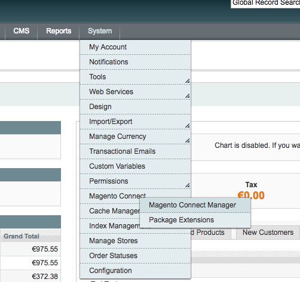
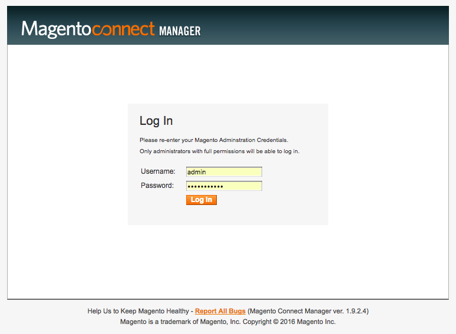
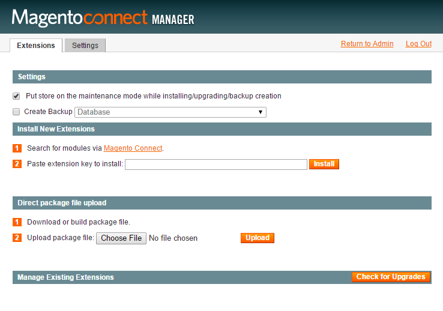

Installation
============

Magento Connect / Downloader
------------------------------------------

Gehen Sie im Magento Backend auf :menuselection:`System --> Konfiguration --> Magento Connect --> Magento Connect Manager`

Loggen Sie sich nochmal mit Ihren Backend-Zugangsdaten ein:

Laden Sie das zur Verfügung gestellte tgz-Archiv im Manager hoch.

Das Modul steht Ihnen nun zur Verfügung. Fahren Sie nun mit der :ref:`configuration` fort.

manuelle Installation / FTP
------------------------------------------

* Laden Sie die Extension von https://www.easycredit-ratenkauf.de/system/magento/ herunter
* Entpacken Sie die Extension in ein temporäres Verzeichnis
* Laden Sie die Extension in die Struktur Ihrer Magento Installation
* Aktualisieren Sie den Cache
* Loggen Sie sich aus dem Magento Admin Panel aus, und wieder ein
* Das Modul steht Ihnen nun zur Verfügung

Fahren Sie anschließend mit der :ref:`configuration` fort.
