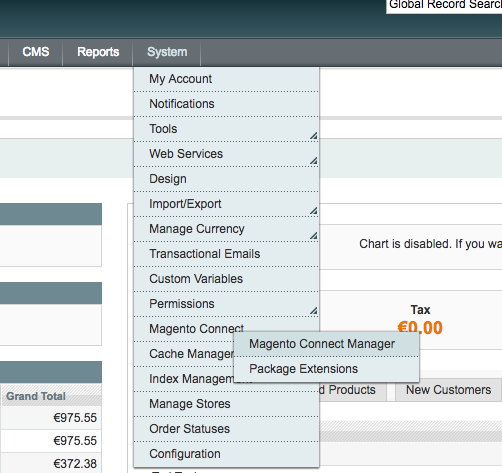
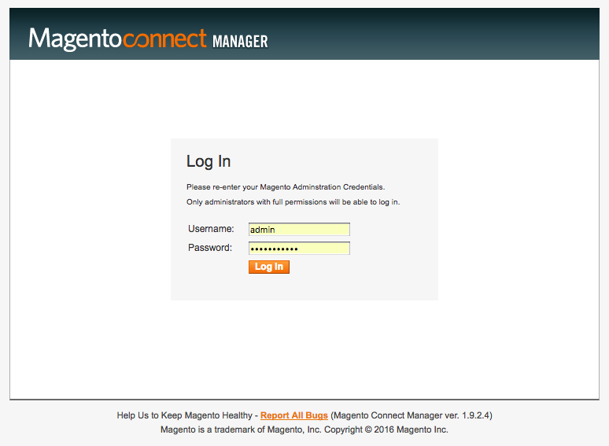

Installation
============

Magento Connect / Downloader
------------------------------------------

To install the extension in the Magento backend navigate to :menuselection:`System --> Konfiguration --> Magento Connect --> Magento Connect Manager`

Re-login with your backend credentials:

And upload the provided tgz file in the Magento Connect Manager:

.. image:: _static/m1-connect-upload.png
        :scale: 50%

The module is now available successfully installed. Continue with :ref:`configuration` now.

Manual Installation / FTP
------------------------------------------

* Download the extension package from our website
* Extract the extension to a temporary directory
* Upload the extension in the strcuture of your Magento installation.
* Refresh the cache
* Log out of Magento backend, and re-login again.

The module is now available successfully installed. Continue with :ref:`configuration` now.
