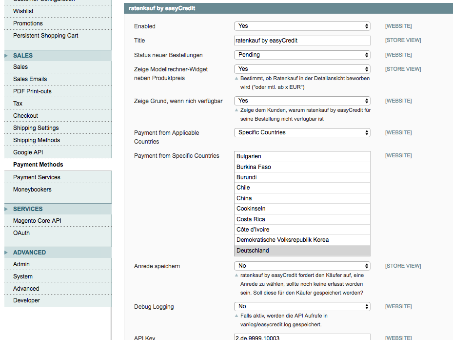
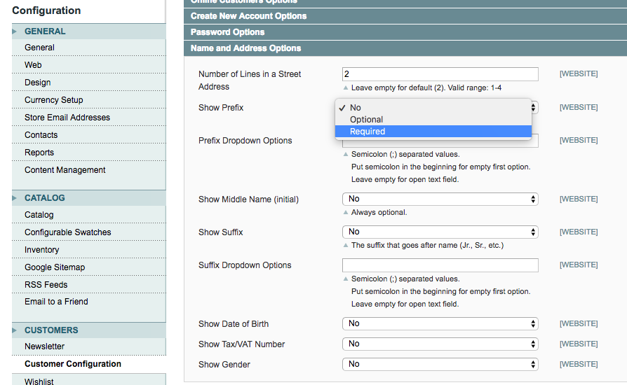

.. _configuration:

============= 
Configuration
=============

The configuration of the module is located at :menuselection: `System --> Configuration --> Payment Methods --> ratenkauf by easyCredit`.

Configure API credentials
------------------------------

* Activate the payment method 
* Enter API credentials in the fields API-Key und API-Token ein.
* Test the credentials with click on **Verify Credentials**.
* If the credentials are correct, click on **Save**.

Configure Prefix
------------------------------

To process **ratenkauf by easyCredit** payments the extension needs the correct prefix of the customer (Herr, Frau).
The prefix field is not part of Magento standard checkout. 

The extension requests the prefix of the user in the payment selection, if not already available.
This prefix can be saved in the customer account by activating the option save prefix. 

If you want to acquire customer prefixes in your store globally, activate the prefix in the register and checkout step.
To do this set the option **Show prefix** to *Required* in :menuselection:`System -> Configuration -> Customer Configuration`.
Additionally set the option  **Prefix Dropdown Options** to *Herr;Frau;*.

